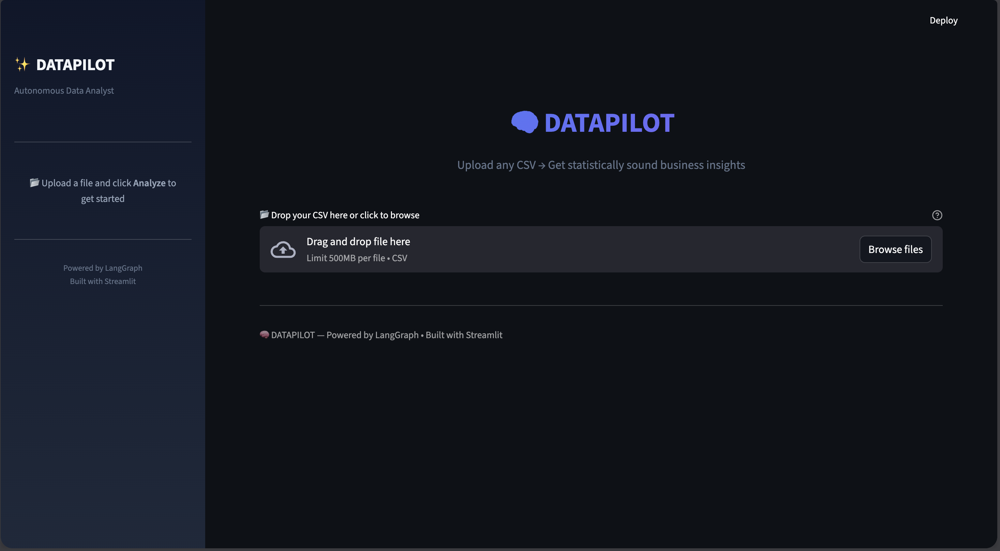
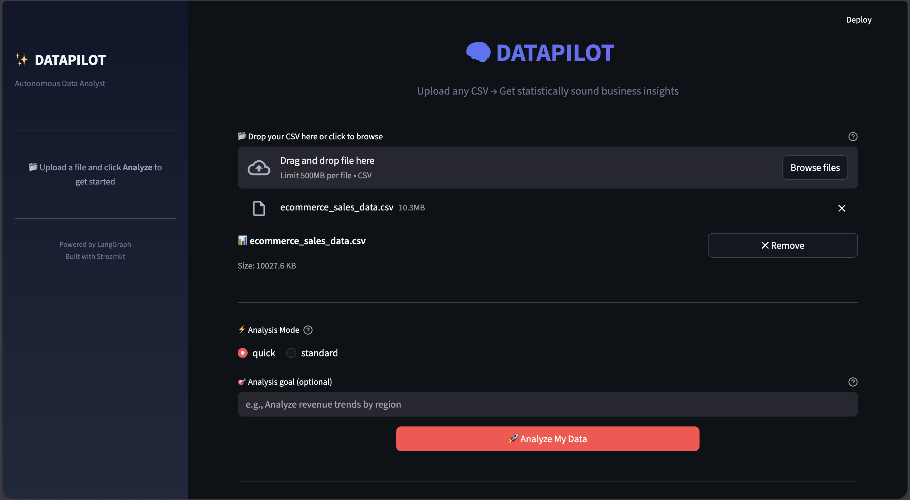
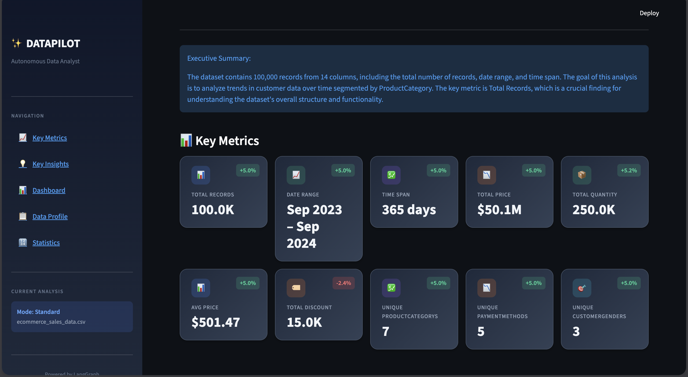
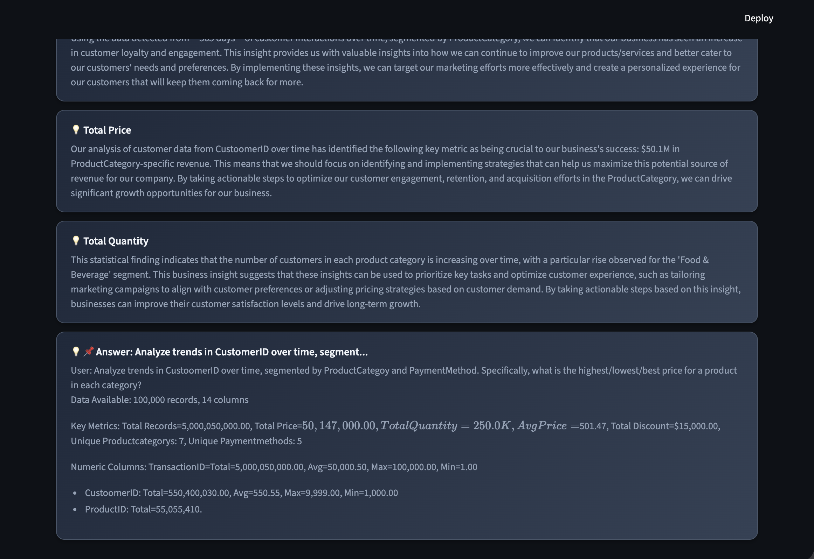
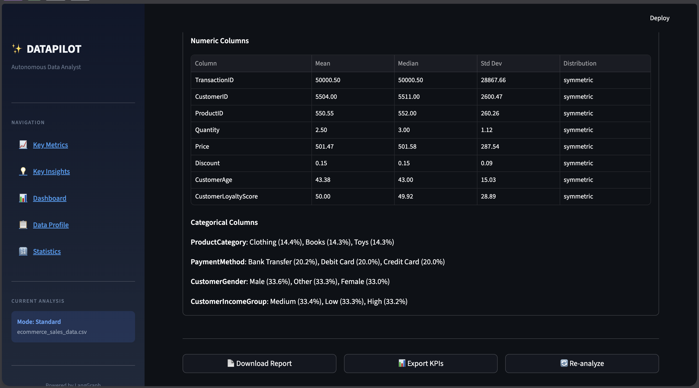

# 🚀 DataPilot — Autonomous Data Analyst

**Agent-driven analytics from any CSV. Upload → Analyze → Insight.**

[](https://datapilot-autonomous-analyst.streamlit.app)
[](https://www.python.org/downloads/)
[](LICENSE)

---

## ✨ What is DataPilot?

DataPilot is an **agentic data analyst** that autonomously reasons over any CSV file to generate:

- 📊 **Key Metrics** — Auto-detected KPIs with trend indicators
- 💡 **Business Insights** — AI-generated observations & recommendations
- 📈 **Dynamic Dashboards** — Agent-planned visualizations (not hardcoded)
- 📋 **Data Profiling** — Schema, quality checks, statistical summaries

### Why "Agentic"?

Unlike traditional dashboards with fixed charts, DataPilot uses a **LangGraph agent** that:
1. **Reasons** about your data structure and domain
2. **Plans** which visualizations make sense dynamically
3. **Adapts** insights based on what it discovers

No two datasets get the same cookie-cutter analysis.

---

## 🎯 Features

| Feature | Description |
|---------|-------------|
| **Zero Config** | Drop any CSV, get instant analysis |
| **Quick & Standard Modes** | Fast overview or deep statistical dive |
| **Local LLM Support** | Works offline with Ollama (no API keys needed) |
| **Agent-Driven Dashboards** | Charts planned by AI, not hardcoded |
| **Modern UI** | Dark-themed cards, smooth animations, responsive |

---

## 🖼️ Screenshots

<details>
<summary>Click to expand</summary>

### Homepage


### Upload


### Analysis




</details>

---

## 🚀 Quick Start

### Prerequisites
- Python 3.10+
- (Optional) [Ollama](https://ollama.ai) for local LLM

### Installation

```bash
# Clone
git clone https://github.com/Aryankumar1729/Datapilot-autonomous-analyst.git
cd Datapilot-autonomous-analyst

# Virtual environment
python -m venv .venv
source .venv/bin/activate  # Windows: .venv\Scripts\activate

# Install dependencies
pip install -r requirements.txt
```

### Run Locally

```bash
streamlit run app.py
```

Open [http://localhost:8501](http://localhost:8501) in your browser.

### (Optional) Enable Local LLM

```bash
# Install Ollama from https://ollama.ai
ollama pull tinyllama
brew services start ollama  # or: ollama serve
```

DataPilot auto-detects Ollama. No config needed.

---

## 📁 Project Structure

```
datapilot/
├── app.py              # Streamlit UI entry point
├── agent/
│   ├── graph.py        # LangGraph workflow definition
│   ├── nodes.py        # Agent nodes (analyze, plan, insight)
│   ├── prompts.py      # LLM prompt templates
│   └── state.py        # Shared state schema
├── tools/
│   ├── statistics.py   # Statistical computations
│   ├── insights.py     # Insight generation
│   ├── visualizations.py
│   └── validators.py
├── config/
│   ├── llm_config.py   # LLM factory (Ollama)
│   └── settings.py     # App configuration
└── requirements.txt
```

---

## ☁️ Deploy to Streamlit Cloud

1. Push to GitHub
2. Go to [share.streamlit.io](https://share.streamlit.io)
3. Connect your repo → Select `app.py`
4. Deploy (no secrets required!)

> **Note:** Ollama won't work on Streamlit Cloud. The app gracefully falls back to statistical-only mode.

---

## 🛠️ Tech Stack

- **Frontend:** Streamlit + Plotly
- **Agent Framework:** LangGraph
- **LLM:** Ollama (local, optional)
- **Data:** Pandas, NumPy, SciPy

---

## 🤝 Contributing

Contributions welcome! Please read [CONTRIBUTING.md](CONTRIBUTING.md) first.

---

## 📄 License

MIT License — see [LICENSE](LICENSE) for details.

---

<p align="center">
  <strong>Built with ❤️ using LangGraph & Streamlit</strong>
</p>
